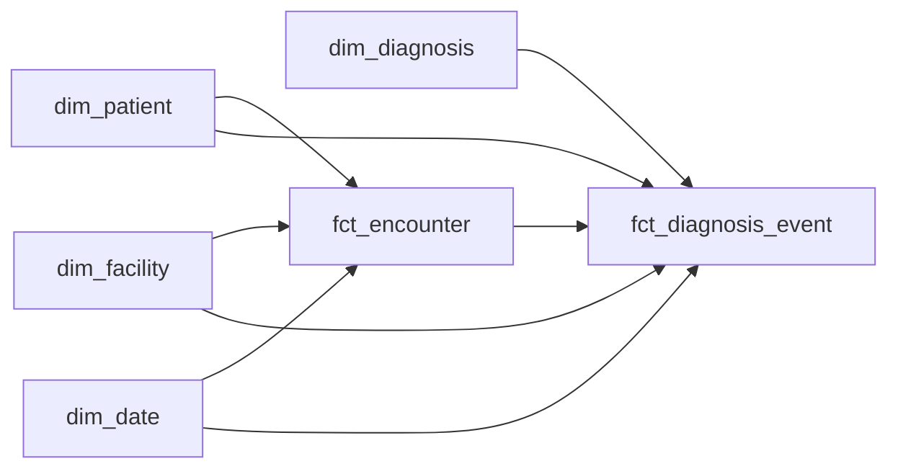
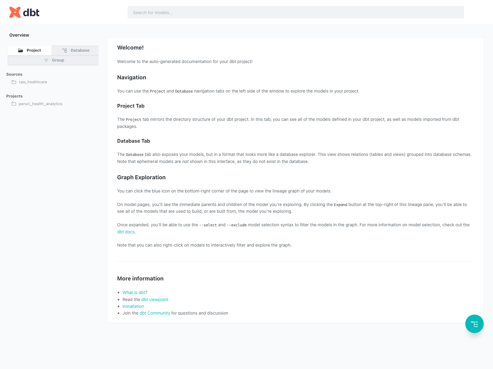

# PERURI Healthcare Analytics Engineering Portfolio

BPJS/SATUSEHAT-inspired analytics engineering project built with `dbt Core` and `BigQuery`. The repo demonstrates the exact signals called out in the PERURI job description: modular SQL transformation, dimensional modeling, automated testing, data documentation, and BigQuery-aware physical design.

## What This Project Proves
- `dbt` project structure with staging and mart layers.
- Explicit star schema with 4 dimensions and 2 facts.
- Automated data tests for uniqueness, relationships, accepted values, and business rules.
- BigQuery partitioning and clustering choices justified against analyst query patterns.
- `dbt docs` lineage workflow with a screenshot artifact for recruiter-friendly scanning.

## Scope
- No dashboard
- No ML
- 10,000 synthetic encounters
- 4,000 patients
- 25 facilities across 5 facility types
- 50 diagnosis codes grouped into 8 healthcare-relevant analytic categories
- 24 months of encounter history from `2024-01-01` to `2025-12-31`

## Warehouse Layout
```text
raw (seeded CSVs)
  ├── raw_patient
  ├── raw_facility
  ├── raw_encounter
  └── raw_diagnosis

staging (views)
  ├── stg_patients
  ├── stg_facilities
  ├── stg_encounters
  └── stg_diagnoses

marts (tables)
  ├── dim_patient
  ├── dim_facility
  ├── dim_date
  ├── dim_diagnosis
  ├── fct_encounter
  └── fct_diagnosis_event
```

## Star Schema


## Analyst Story
The marts are intentionally designed around three analyst questions only:

1. `Volume trend`: how monthly encounter volume changes by facility type.
2. `Diagnosis mix`: how diagnosis groups move over time and differ by facility type.
3. `Facility performance`: which facilities carry the highest load, average LOS, average cost, and revisit rates.

Those three questions define the column set. Anything not supporting them was left out on purpose.

## BigQuery Physical Design
- `fct_encounter` is designed to be partitioned by `admission_date` because all three analyst queries begin with time filters on encounter activity.
- `fct_encounter` is clustered by `facility_key` and `patient_key` because facility performance and revisit checks repeatedly filter and aggregate on those keys.
- `fct_diagnosis_event` is designed to be partitioned by `diagnosis_event_date` because diagnosis mix analysis is time-series first.
- `fct_diagnosis_event` is clustered by `facility_key` and `diagnosis_key` because diagnosis mix queries commonly group by facility type and diagnosis group after filtering to date ranges.
- The checked-in default keeps clustering enabled and leaves partitioning behind an opt-in dbt var. This makes the demo build runnable on a free-tier / no-billing project where partitioned CTAS did not populate rows during validation.

## Domain Framing
This is synthetic data, but the project narrative is aligned to Indonesian healthcare operations rather than US-centric EHR demos:
- Facility types reflect Indonesian service points such as `Puskesmas`, `Klinik`, and `Laboratorium`.
- The model structure mirrors a BPJS/SATUSEHAT-style analytics layer: patient, facility, encounter, and diagnosis events.
- Diagnosis groups are simplified for analytics but remain healthcare-relevant for chronic disease, infectious disease, maternal/child, and utilization analysis.

Reference material used for framing:
- [SATUSEHAT introduction](https://satusehat.kemkes.go.id/platform/docs/id/playbook/introduction/)
- [SATUSEHAT services](https://satusehat.kemkes.go.id/platform/docs/id/playbook/service/)
- [Healthkathon 2023](https://biz.kompas.com/read/2023/10/01/104153328/bpjs-kesehatan-umumkan-9-tim-terbaik-di-ajang-healthkathon-2023)
- [Healthkathon 2024](https://www.medcom.id/ekonomi/bisnis/GNlPpomN-digitalisasi-program-jkn-bpjs-kesehatan-gelar-healthkathon-2024)
- [BPJS/JKN claims schema paper](https://jurnal-jkn.bpjs-kesehatan.go.id/ojs-new/index.php/jjkn/article/download/134/58/1136)

## Setup
### 1. Create the Python environment
```bash
/usr/local/bin/python3.12 -m venv .venv
.venv/bin/pip install -r requirements.txt
```

### 2. Optional: mirror local gcloud credentials into the repo sandbox
If your local `gcloud` config is available but your shell cannot write to `~/.config/gcloud`, copy it into the workspace:

```bash
./scripts/sync_gcloud_config.sh
export CLOUDSDK_CONFIG=$PWD/.gcloud
export CLOUDSDK_PYTHON=python3
```

### 3. Set dbt profile env vars
```bash
export DBT_PROFILES_DIR=$PWD/profiles
export GCP_PROJECT=perfect-operand-436506-n7
export DBT_DATASET_DEFAULT=analytics_dev
export DBT_LOCATION=asia-southeast2
export DBT_THREADS=4
```

If you are running with a service account in CI or locally:

```bash
export DBT_BIGQUERY_KEYFILE_JSON="$(cat path/to/service-account.json)"
```

Then use the `ci` target instead of `dev`:

```bash
.venv/bin/dbt build --profiles-dir profiles --target ci
```

### 4. Generate the raw data
```bash
.venv/bin/python scripts/generate_synthetic_data.py
```

### 5. Build the warehouse
```bash
.venv/bin/dbt seed --profiles-dir profiles --full-refresh
.venv/bin/dbt build --profiles-dir profiles
```

If your local ADC refresh token is stale but `gcloud auth print-access-token` still works, use the workspace-token wrapper instead:

```bash
./scripts/run_dbt_with_workspace_token.sh seed --full-refresh
./scripts/run_dbt_with_workspace_token.sh build
```

To enable the partitioned fact-table design on a billed BigQuery project:

```bash
./scripts/run_dbt_with_workspace_token.sh build --vars '{enable_partitioned_facts: true}'
```

## Documentation And Lineage Screenshot
Generate docs and capture the screenshot used in this README:

```bash
./scripts/capture_lineage_screenshot.sh
```

The script runs:
- `dbt docs generate --empty-catalog`
- `dbt docs serve`
- headless Chrome screenshot capture to `assets/dbt-lineage.png`

## Lineage Screenshot
If the screenshot has been generated locally, it will appear here:



## Validation
The project includes:
- generic tests in schema YAML for uniqueness, relationships, and accepted values
- singular tests for discharge-before-admission, negative cost, and negative LOS
- three analyst-facing SQL files under [`analyses/`](./analyses)

Run:

```bash
.venv/bin/dbt test --profiles-dir profiles
```

## CI Strategy
GitHub Actions always runs `dbt parse`. When a BigQuery service-account secret is available, the workflow also runs `dbt seed` and `dbt build`. This keeps the repo mergeable even if CI auth is not configured yet, while still supporting full warehouse validation once secrets are added.

## Suggested CV Bullets
- Built a BPJS/SATUSEHAT-inspired analytics engineering warehouse on BigQuery using `dbt`, transforming synthetic raw encounter and diagnosis data into tested star-schema marts for volume, diagnosis-mix, and facility-performance reporting.
- Implemented automated data quality checks, generated lineage/documentation with `dbt docs`, and optimized BigQuery facts with partitioning and clustering aligned to healthcare analytics query patterns.
